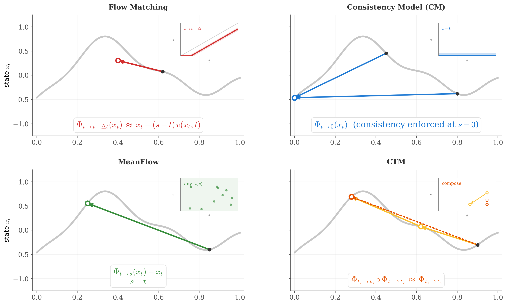
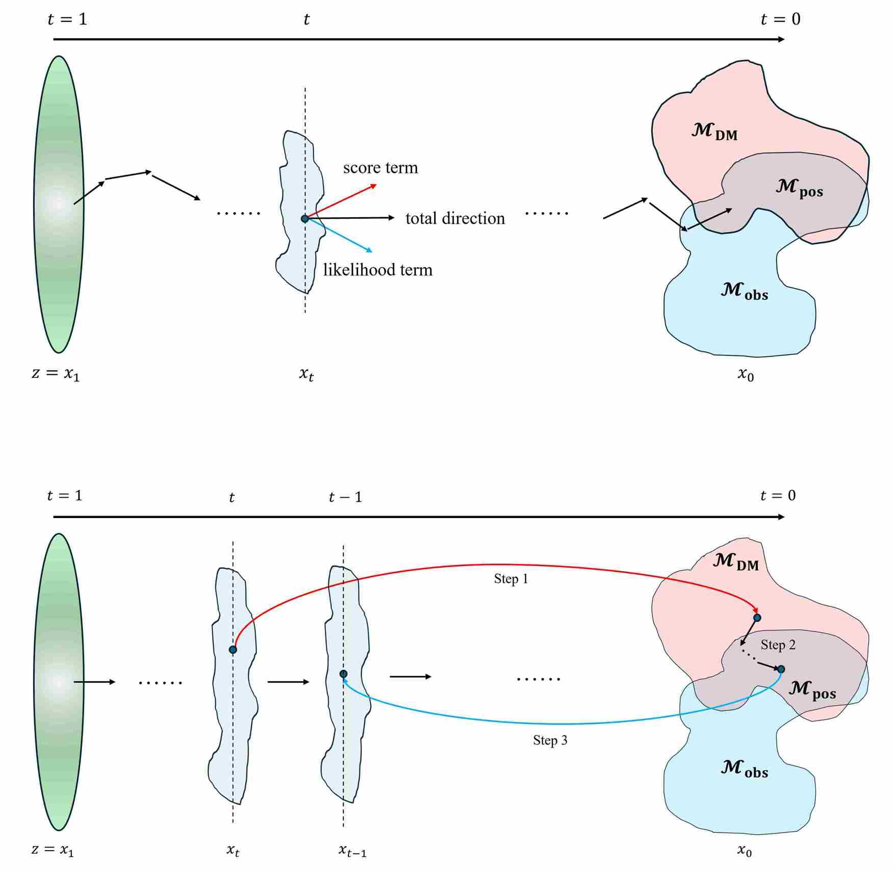

<b>About me:</b>

I study **diffusion/flow-matching models** and **multimodal foundation models**, for which you can find more in my [blog post](https://innovation-cat.github.io/year-archive/).

- **On the Generative side**: I study the “impossible triangle” of high fidelity, fast sampling, and strong controllability—designing training and inference methods (distillation, guidance, solver-aware sampling) that expand the Pareto frontier.

- **On the Multimodal side**: I study to build native multimodal architectures that achieve a true unification of understanding and generation, enabling AI to perceive, reason, and create within a single, cohesive framework.

**Contact Me:** <strong style="color: #1D4ED8; font-weight: bold; text-decoration: underline;">huanganbu@gmail.com</strong>

---

**Previously**: I have also worked on areas including recommender systems, federated learning and AI safety. I have published multiple research papers at AI conferences such as ICLR and AAAI ([Publication](https://innovation-cat.github.io/publications/)). 

## Selected Publications

  <!-- ===== Publication 1 ===== -->
  

    

      
    

    

      <h3 class="pub-title">
        <a href="https://iclr-blogposts.github.io/2026/blog/2026/flow-map-learning/">
          <strong>From Trajectories to Operators — A Unified Flow Map Perspective on Generative Modeling</strong>
        </a>
      </h3>

      

        Anbu Huang
      

      

        <strong>ICLR 2026 BlogPost Track.</strong>
      

      <!-- 可选：摘要（点击 ABSTRACT 跳转） -->
      

        <strong>Abstract.</strong>  we reframe continuous-time generative modeling from integrating trajectories to learning two-time operators (flow maps). This operator view unifies diffusion, flow matching, and consistency model. 
      

      
      

        <a class="pub-btn" href="https://iclr-blogposts.github.io/2026/blog/2026/flow-map-learning/">Paper</a>
      

      
      
    

  

  <!-- ===== Publication 2 ===== -->
  

    

      
    

    

      <h3 class="pub-title">
        <a href="https://iclr-blogposts.github.io/2026/blog/2026/diffusion-inverse-problems/">
         <strong>Navigating the Manifold —  A Geometric Perspective on Diffusion-Based Inverse Problems</strong>
        </a>
      </h3>

      

        Anbu Huang
      

      

        <strong>ICLR 2026 BlogPost Track.</strong>
      

      <!-- 可选：摘要（点击 ABSTRACT 跳转） -->
      

        <strong>Abstract.</strong>   We show that a wide range of methods mostly instantiate two operator-splitting paradigms, i.e., posterior-guided sampling and clean-space local-MAP optimization.  
      

      
      

        <a class="pub-btn" href="https://iclr-blogposts.github.io/2026/blog/2026/diffusion-inverse-problems/">Paper</a>
      

      
      
    

  

